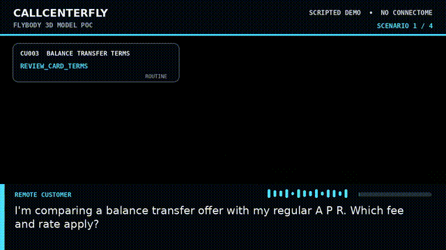
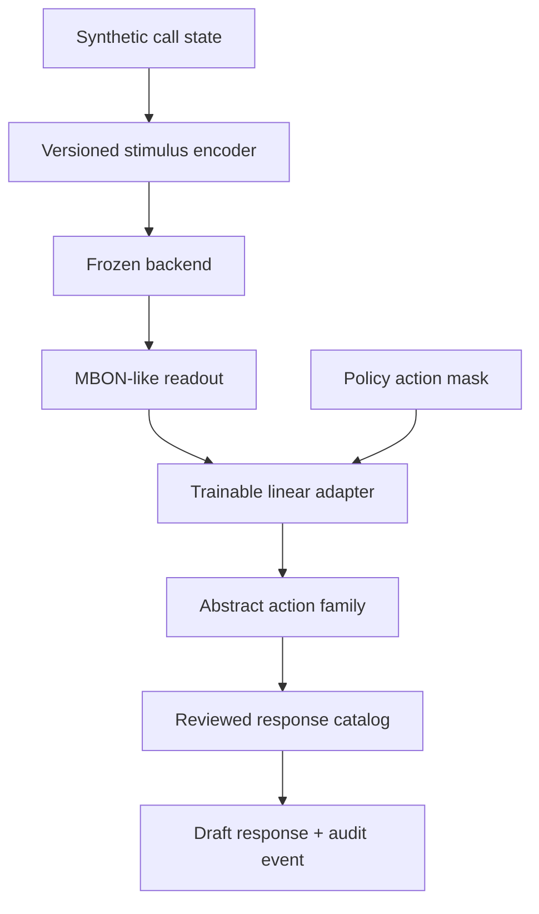

# CallCenterFly 🪰🎧

**Can a frozen fruit-fly connectome help choose the next safe action in a synthetic
credit-union call?**

CallCenterFly is an open research project that connects structured, fully synthetic
contact-center scenarios to a fruit-fly-connectome simulation and trains a small
masked action-selection adapter on top. It does not train the biological wiring
diagram itself, generate financial advice, or operate a real member account.

> **Status: baseline scaffold, not a demonstrated learning result.** The committed
> model uses a deterministic mock readout so the complete pipeline can be tested
> without downloading or simulating MaleCNS. Real-connectome integration and its
> scientific validation gates remain open work.



[Watch the 65.9-second OpenGL PoC](media/CallCenterFly_FlyBody_OpenGL_PoC.mp4) ·
[Read the full specification](docs/PROJECT_SPECIFICATION.md) ·
[Review the experiment protocol](docs/EXPERIMENT_PROTOCOL.md)

## What is in the baseline

- A deterministic **CSV/JSONL synthetic dataset**: 25 scenario families, 2,500 calls,
  and 7,500 decision points; no XLS/XLSX and no real member data.
- Real-world issue categories such as balance transfers, Zelle payment status and
  unauthorized transfers, ACH, card disputes, deposit holds, account takeover,
  fees, loans, wires, and membership eligibility.
- A stable sensory-encoder contract, frozen-connectome backend protocol, action masks,
  and a small contextual-bandit policy adapter.
- A deterministic `mock` backend for CI and local development, clearly separated from
  the future full MaleCNS simulator.
- Draft, post-selection response templates that are deliberately marked for institution,
  operations, compliance, and legal review.
- Training, evaluation, inference, audit, and optional FastAPI service entry points.
- A software-rendered FlyBody/OpenGL visualization PoC. The video is theater for the
  interface concept; it does not show a running connectome.

## System boundary



The default backend produces a **mock readout**. A future `malecns` backend must use
the complete retained graph and may not be silently substituted, cropped, or pruned.

## Quick start

Requires Python 3.11 or newer.

```bash
python -m venv .venv
source .venv/bin/activate
python -m pip install --upgrade pip
python -m pip install -e '.[dev,serve]'

callcenterfly validate-data --dataset data/synthetic/v0.1.0
python -m pytest
python scripts/smoke_test.py
```

Train a fresh mock baseline:

```bash
callcenterfly train \
  --dataset data/synthetic/v0.1.0 \
  --output artifacts/mock-run \
  --epochs 4 \
  --seed 20260913
```

Evaluate and inspect one held-out decision:

```bash
callcenterfly evaluate \
  --dataset data/synthetic/v0.1.0 \
  --model models/mock-baseline-v0 \
  --split test

callcenterfly infer \
  --dataset data/synthetic/v0.1.0 \
  --model models/mock-baseline-v0 \
  --decision-id SYN-CU-010-CU004-086-D2
```

The inference result includes the eligible actions, ranked probabilities, selected
action family, draft response ID, review status, and `connectome_used` flag.

## MaleCNS data

MaleCNS v1.0 is a fixed biological reconstruction, not a pretrained AI model. The
official release provides annotations, neurotransmitter predictions, and a 1.1 GB
full connection graph. These files are not committed here.

```bash
python scripts/download_malecns.py --destination connectome_data/malecns_v1
callcenterfly verify-connectome \
  --registry config/datasets/malecns_v1.json \
  --data-dir connectome_data/malecns_v1
```

The downloader verifies every byte count and SHA-256 digest. Downloading the data does
not enable the backend by itself; the full simulator kernel remains an explicit future
integration milestone.

## Repository layout

| Path | Purpose |
| --- | --- |
| `src/callcenterfly/` | Dataset, encoder, backend, policy, training, inference and service code |
| `data/synthetic/v0.1.0/` | Reproducible synthetic dataset release |
| `data/scripts/response_catalog.csv` | Draft action-to-wording layer; not policy weights |
| `config/datasets/` | Locked external-data registries |
| `models/mock-baseline-v0/` | Committed no-connectome software baseline |
| `docs/` | Specification, protocol, API, model card and third-party scope |
| `media/` | FlyBody/OpenGL concept video and QA images |
| `tests/` | Fast, graph-free regression suite |

## Scientific and operational honesty

- MaleCNS maps structure, not the full physiology of a living fly.
- Stimulus mappings, neural dynamics, readouts, rewards, masks, and response scripts are
  engineered choices unless a source says otherwise.
- A better reward curve, changed adapter weights, or long runtime is not sufficient
  evidence of biological learning.
- No output is production-approved financial guidance. No component may authenticate a
  member, disclose account data, move funds, promise outcomes, or replace human review.

See [MaleCNS's official download page](https://male-cns.janelia.org/download/), the
[Google Research release overview](https://research.google/blog/a-connectomics-milestone-mapping-the-complete-male-fruit-fly-brain/),
and the [MaleCNS paper](https://doi.org/10.1016/j.cell.2026.08.015).

## License

Original CallCenterFly code, documentation, and synthetic dataset are MIT licensed.
External MaleCNS data and FlyBody-derived media have separate provenance and terms in
[`docs/THIRD_PARTY.md`](docs/THIRD_PARTY.md). MaleCNS data is not bundled.
