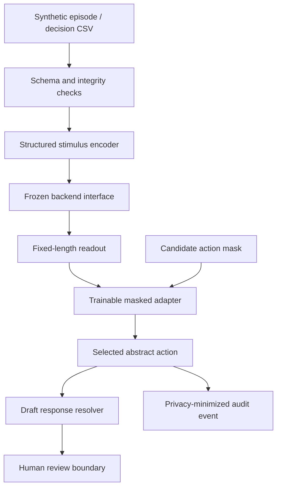

# CallCenterFly project specification

**Specification version:** 0.1.0
**Date:** 2026-09-13
**Repository:** <https://github.com/creditunionfruitfly/CallCenterFly>
**Status:** baseline implementation; real MaleCNS integration not yet implemented

## 1. Executive summary

CallCenterFly is an experimental system for testing whether simulated activity from a
fixed adult male fruit-fly connectome can serve as a state representation for selecting
safe, abstract next actions in synthetic credit-union contact-center scenarios.

The connectome is not a language model and is not trained by this project. Call state is
converted through an engineered stimulus mapping, propagated through a frozen backend,
and summarized as an output vector. A small trainable adapter selects one eligible
action family. A separate, review-controlled catalog may then map that action to fixed
wording. The system never generates arbitrary financial advice or directly operates an
account.

Baseline v0.1 implements the complete software seam with a deterministic mock backend.
It does not yet include the full MaleCNS simulator. The mock exists so data, action masks,
training, artifact handling, inference, audit, and CI can be tested without a multi-GB
runtime or an implied neuroscience result.

## 2. Research question and hypotheses

### Primary question

Can a trainable readout over frozen MaleCNS-derived activity select the preferred or an
acceptable abstract servicing action better than non-connectome controls on held-out,
synthetic call scenarios?

### Hypotheses

- **H1 — software feasibility:** the pipeline can deterministically transform one
  decision record into a mask-valid action and audited response identifier.
- **H2 — representation utility:** a linear adapter trained on frozen real-connectome
  readouts will outperform an equally sized adapter trained on matched random features.
- **H3 — generalization:** any improvement survives template-family-separated validation
  and held-out test splits.
- **H4 — causal dependence:** ablating the documented sensory mapping or disconnecting
  graph propagation materially degrades the measured effect.
- **H5 — safety boundary:** action masking produces zero out-of-mask selections in every
  software, training, and evaluation run.

H1 is testable in baseline v0.1. H2–H4 cannot be evaluated until the full verified graph
backend exists. H5 is a software invariant, not proof of regulatory compliance.

## 3. Terminology

| Term | Meaning in this project |
| --- | --- |
| MaleCNS | The published adult male *Drosophila* brain and ventral nerve cord structural connectome. |
| Connectome | A measured wiring graph; not a pretrained task model or complete physiological brain state. |
| Stimulus encoder | Engineered conversion of structured call state and synthetic text into backend input. |
| Backend | A frozen transformation from stimulus to a fixed-length readout. |
| Mock backend | Deterministic random projection used only for software tests; no connectome is loaded. |
| Readout | Backend output presented to the trainable adapter; later intended to represent selected neural activity. |
| Adapter | Small trainable linear softmax policy; the only trainable model in baseline v0.1. |
| Action mask | Externally supplied set of actions eligible in the current phase and policy context. |
| Action family | Abstract objective such as `VERIFY_IDENTITY` or `REVIEW_DEPOSIT_HOLD`. |
| Response catalog | Fixed post-selection wording associated with action families and review status. |
| Episode | One synthetic call with three ordered decision points. |

## 4. Scope

### 4.1 Included in v0.1

- Dataset release v0.1.0 with 25 balanced scenario families.
- 2,500 synthetic three-decision episodes and 7,500 flattened decision rows.
- CSV-first inspection/training tables and JSONL episode sequences.
- Deterministic structured stimulus encoder.
- Frozen backend protocol and deterministic mock implementation.
- Masked linear action-selection adapter.
- Full-information contextual-bandit training objective.
- Offline validation/test metrics.
- Safe `npz` plus JSON model artifacts.
- CLI for validation, training, evaluation, inference, and data verification.
- Optional FastAPI service boundary with privacy-minimizing JSONL audit events.
- Draft response catalog covering all 26 abstract actions.
- Locked MaleCNS external-data registry and hash-verifying downloader.
- FlyBody/OpenGL concept video, explicitly separate from neural execution.

### 4.2 Explicitly excluded from v0.1

- Full MaleCNS graph import, native simulation kernel, or GPU execution.
- A validated projection-neuron, Kenyon-cell, MBON, or dopamine pathway mapping.
- Synaptic plasticity inside MaleCNS.
- ASR, telephony, CRM, core-processing, card-processing, Zelle, or payment integrations.
- Real calls, real member data, institution names, credentials, or account identifiers.
- Production-approved scripts, policy facts, fees, limits, timeframes, or legal findings.
- Account authentication, transaction execution, fraud adjudication, or legal coverage
  determination.
- Autonomous member-facing deployment.

## 5. Scientific source boundary

The official MaleCNS release describes an adult male fly brain and central nervous
system with more than 166,000 neurons and 125 million synaptic contacts. The flat full
connection graph is published as a roughly 1.1 GB Feather file. The project registry
locks the three inputs needed for a first simulator integration:

| File | Expected bytes | Role |
| --- | ---: | --- |
| `annotations.feather` | 14,483,314 | Cell annotations and retention classification |
| `neurotransmitters.feather` | 43,282,834 | Aggregate transmitter predictions |
| `edges.feather` | 1,051,241,946 | Segment-to-segment connection weights |

Sources and hashes live in `config/datasets/malecns_v1.json`. MaleCNS data remains
external and CC BY 4.0 licensed. Downloading the files does not imply that a simulation
is biologically faithful.

The future retained-graph policy is:

1. Retain every entry with an assigned neuronal superclass, including uncertain
   neuronal classes.
2. Exclude entries explicitly classified as glia/non-neuronal.
3. Retain every released edge for which both endpoints survive the node policy.
4. Do not remove self-connections or add a project-specific weight threshold.
5. Record counts, exclusions, source hashes, normalization code, and resulting graph
   hashes as immutable provenance.

Any deviation requires a separately named ablation or engineering baseline. It may not
be called the full MaleCNS run.

## 6. Functional architecture



### 6.1 Separation rules

- The encoder may consume only declared observation fields and synthetic utterance text.
- The backend may consume only the encoder output and explicit simulation parameters.
- The adapter may consume only the backend readout and candidate mask.
- Labels and rewards are available during training/evaluation only.
- The mask may eliminate ineligible actions but may not encode a ranking.
- The response resolver runs after selection and is not trainable.
- No operational side effect occurs from selection or response resolution.

## 7. Dataset contract

### 7.1 Release invariants

- `dataset_version` is `0.1.0`.
- Every episode is marked `synthetic: true` and contains exactly three member turns.
- Split sizes are 1,750 train, 375 validation, and 375 test episodes.
- Flattened decision sizes are 5,250 train, 1,125 validation, and 1,125 test rows.
- Scenario distribution is balanced in every split.
- Template families and exact utterances do not cross split boundaries.
- `script_text_status` remains `NOT_INCLUDED` in the learning dataset.
- Preferred and acceptable actions are members of `candidate_actions_json`.
- Candidate reward keys equal the candidate mask.
- No XLS/XLSX artifact is part of the project.

### 7.2 Observation fields

The baseline encoder consumes:

- phase, scenario family, category, product, and intent;
- valence, arousal, urgency, authentication state, and risk tier;
- authorization/status claims and business-day context;
- bounded transformations of synthetic amount and event age; and
- hashed tokens from the synthetic member utterance.

The amount and age are scenario facts, not policy terms. An authorization claim is a
member assertion, not an adjudicated fact.

### 7.3 Target fields

- `action_mask_group`
- `candidate_actions_json`
- `preferred_action_family`
- `acceptable_action_families_json`
- `prohibited_behaviors_json`
- `candidate_rewards_json`

Default reward semantics are preferred `+1.00`, acceptable `+0.25`, other mask-eligible
`-1.00`, and prohibited behavior `-3.00`. Prohibited behaviors are never inserted as
selectable production actions.

## 8. Stimulus encoder

### 8.1 Baseline algorithm

`StructuredStimulusEncoder` uses stable BLAKE2 hashes to project categorical field/value
pairs and bounded utterance tokens into a fixed-length vector. Synthetic amount and age
are log-scaled. The vector is normalized, then adjusted by a declared gain derived from
arousal, urgency, and negative valence.

The purpose is deterministic interface testing. It is not claimed to reproduce odor
identity, odor concentration, projection-neuron firing, or any measured fly physiology.

### 8.2 Future biological mapping requirements

A future mushroom-body-oriented encoder must provide:

- exact MaleCNS IDs and annotations for every stimulated cell;
- reason for selecting each projection-neuron population;
- the mapping from phase/intent patterns to injected currents or spike trains;
- the mapping from sentiment/arousal to amplitude, duration, or gain;
- units, timestep, settle window, and numerical bounds;
- calibration evidence or an explicit statement that values are assumptions;
- counterbalanced codes so labels are not privileged by neuron count or magnitude; and
- ablations, permutations, and null inputs.

## 9. Backend contract

Every backend exposes:

```python
reset() -> None
run(stimulus: ndarray, settle_steps: int) -> ConnectomeObservation
```

The observation contains a fixed-length readout, backend name, `connectome_used`, and
diagnostics. A backend must not mutate source connectome weights during baseline adapter
training.

### 9.1 Mock backend

The mock applies a seeded fixed random projection and bounded recurrence. It exists only
for deterministic tests. Reports and API responses must identify it and set
`connectome_used: false`.

### 9.2 MaleCNS backend milestone

The `MaleCNSBackend` class intentionally raises `BackendUnavailable` in v0.1. A future
implementation must not be merged until it provides:

- verified source registry and normalized graph lock;
- full retained graph counts and hashes;
- explicit dynamics equations, transmitter-sign assumptions, timestep and delays;
- CPU/GPU numerical parity tests on reference networks and sampled full runs;
- declared readout cell IDs and aggregation window;
- deterministic checkpoint format without unsafe pickle loading;
- frozen-weight verification before and after adapter training; and
- performance/memory benchmarks on the documented reference machine.

## 10. Adapter and learning objective

### 10.1 Model

The adapter is a linear layer plus masked softmax:

\[
p(a\mid z,M)=\operatorname{softmax}_{a\in M}(Wz+b),
\]

where \(z\) is the frozen backend readout and \(M\) is the eligible action set.

### 10.2 Baseline training

Because the synthetic dataset supplies a reward for every candidate action, v0.1 uses a
full-information contextual-bandit objective. For probability \(p_i\), reward \(r_i\),
and expected reward \(J=\sum_i p_i r_i\), the logit ascent signal is:

\[
\frac{\partial J}{\partial l_i}=p_i(r_i-J).
\]

Only `W` and `b` change. The encoder and backend remain fixed. This is an immediate-
reward baseline, not a multi-turn RL claim.

### 10.3 Future sequential objective

An episode-level environment may later model all three phases and delayed call-resolution
reward. It must preserve phase masks, avoid leaking future labels, distinguish member
state from policy state, and compare against the contextual-bandit baseline before a
multi-turn claim is made.

## 11. Action masks and response scripts

The action mask is a deterministic safety and workflow boundary supplied by the task
environment. The policy assigns probability only within that set. A mask violation is a
hard failure.

The learning dataset contains action objectives but no agent wording. The separate
`data/scripts/response_catalog.csv` provides one draft template for each action family.
Every baseline entry is `DRAFT_REVIEW_REQUIRED` and lists required policy slots and
claims it must not make.

Approval workflow for any future script:

1. Contact-center operations verifies workflow and ownership.
2. Product owner supplies current institution-specific facts.
3. Compliance/legal reviews disclosures, regulatory classification, and prohibited
   commitments.
4. Information security reviews authentication and data handling.
5. Accessibility and plain-language review is completed.
6. An immutable script version, approval identities, dates, and expiry/review date are
   recorded.
7. Only then may status change from draft to an approved environment-specific value.

Scripts are selected, never generated. Slot filling must use authoritative systems and
may not invent a rate, fee, balance, hold date, credit, eligibility result, or outcome.

## 12. Training pipeline

1. Verify dataset manifest, counts, masks, rewards, split leakage, and synthetic flag.
2. Pin encoder, backend, action vocabulary, seeds, and software version.
3. Precompute frozen readouts for the train split.
4. Train adapter for the configured epochs.
5. Evaluate frozen parameters on validation after each epoch.
6. Select configuration without reading test outcomes.
7. Run one final held-out test evaluation.
8. Save `adapter.npz`, `metadata.json`, and evaluation JSON.
9. Record backend type and `connectome_used` in every artifact.

Artifacts must not use Python pickle or embed external research data.

## 13. Inference pipeline

1. Receive a schema-valid decision observation and externally computed candidate mask.
2. Reject empty masks or unknown action codes.
3. Encode the observation.
4. Reset and run the selected frozen backend for the declared settle window.
5. Apply the masked adapter and return a ranked eligible list.
6. Resolve the selected action to a versioned response entry.
7. Require human review and record a minimal audit event.
8. Execute no account or payment side effect.

Labels, acceptable actions, and rewards must be absent from a real inference request.
They appear in the CLI sample only because it evaluates a known synthetic row.

## 14. API and operational boundary

The optional service exposes:

- `GET /healthz`
- `POST /v1/decision`

It binds to localhost by default. Baseline responses always include:

- backend name;
- `connectome_used`;
- selected and ranked eligible actions;
- response ID, text, and review status;
- `human_review_required: true`; and
- `production_ready: false`.

Audit logs omit raw utterances by default and record only a hashed decision reference,
scenario/phase/risk labels, mask, selected action, script ID, backend, and timestamp.

## 15. Security, privacy, and compliance requirements

| ID | Requirement |
| --- | --- |
| SEC-001 | Commit no credentials, production endpoints, tokens, or private keys. |
| SEC-002 | Use only synthetic data in the repository and automated tests. |
| SEC-003 | Do not log raw utterances by default. |
| SEC-004 | Reject unknown or empty action masks. |
| SEC-005 | Load model arrays with `allow_pickle=False`. |
| SEC-006 | Verify external data by exact byte count and SHA-256. |
| SEC-007 | Bind the development service to loopback unless explicitly configured. |
| SEC-008 | Perform no account-changing operation. |
| SEC-009 | Treat all response scripts as unapproved until governance metadata says otherwise. |
| SEC-010 | Run dependency, secret, and static checks before a public release. |

The project is research software, not legal advice. Regulation E, Regulation Z,
Regulation CC, UDAAP, privacy, records-retention, model-risk, fair-lending, accessibility,
and institution-specific policies require qualified review before any live test.

## 16. Observability and reproducibility

Every experiment report must record:

- source commit and dirty-state flag;
- dataset version and hashes;
- backend type and graph hash when applicable;
- encoder version and mapping file hash;
- action/response catalog versions;
- seed, hyperparameters, device, and dependency lock;
- train/validation/test counts;
- full metrics and confidence intervals;
- controls and ablations run;
- frozen-weight verification;
- failed gates and interpretation limits.

Raw operational logs, mutable checkpoints, and large external graph files remain ignored.
Publication artifacts should contain compact evidence and retrieval instructions.

## 17. Evaluation metrics

Baseline metrics:

- preferred-action accuracy;
- preferred-or-acceptable rate;
- mean candidate reward;
- mask-violation rate;
- high-risk preferred-action accuracy; and
- per-scenario and per-action confusion counts in future reports.

Production-style accuracy is not the research claim. Real-connectome usefulness requires
comparison with lookup, phase-only, text-only, fixed random feature, shuffled-label,
permuted-input, and graph-ablation controls under identical splits and adapter capacity.

## 18. Acceptance criteria

### Baseline commit gate

- [x] Empty remote cloned without rewriting history.
- [x] Synthetic v0.1 dataset included with original hashes and generator.
- [x] No XLS/XLSX files.
- [x] Mock backend explicitly reports no connectome.
- [x] Train/evaluate/infer commands implemented.
- [x] All 26 actions have draft response entries.
- [x] Full tests and smoke test run without graph downloads.
- [x] FlyBody/OpenGL PoC included and labeled visualization-only.
- [ ] Real MaleCNS simulator implemented.
- [ ] Biological input/readout mapping reviewed.
- [ ] Real-connectome training experiment run.

### Real-connectome experiment gate

Before any “fly learned” statement, all conditions in `docs/EXPERIMENT_PROTOCOL.md`
must pass, including causal controls, repeated seeds, held-out improvement over matched
baselines, frozen source weights, and an explicit limitations report.

## 19. Deployment profiles

### Local/CI profile

- Core Python install and mock backend.
- No graph download.
- Suitable for Linux, macOS, Windows, and ordinary CI runners.

### Single-GPU research profile

- Python 3.11 recommended.
- NVIDIA CUDA 12.x or a separately validated Apple MPS path.
- 32 GB system RAM recommended; GPU memory target 12 GB or more.
- External MaleCNS inputs and future native/CuPy/PyTorch kernel.
- Headless, resumable experiment process with frequent safe checkpoints.

AirGPU may support an interactive Windows research run if unattended session behavior,
disk persistence, CUDA access, and billing are confirmed. A purpose-built headless GPU
provider is generally a cleaner fit for long experiments. No cloud deployment is
certified by v0.1.

## 20. Roadmap

### Phase 0 — visualization PoC (complete)

FlyBody 3D model at a cubicle, two synthetic voices, four scenarios, software OpenGL,
and no connectome.

### Phase 1 — repository baseline (this commit)

Data contracts, mock end-to-end pipeline, response layer, operational shell, tests,
documentation, and CI.

### Phase 2 — full graph integration

Verified importer, normalized source lock, simulator kernel, numerical reference tests,
CPU/GPU parity, checkpointing, and fixed readout extraction.

### Phase 3 — sensory/readout experiment design

Anatomically documented projection-neuron stimulation, sentiment gain, MBON readout,
counterbalancing, null/permutation controls, and preregistered gates.

### Phase 4 — adapter experiments

Contextual-bandit trials, matched baselines, multiple seeds, held-out evaluation,
negative-results publication, and no production traffic.

### Phase 5 — governed shadow evaluation

Only after scientific and policy review: offline or shadow-mode evaluation on separately
approved synthetic/annotated data, with no member-visible response or account action.

## 21. Open decisions

- Exact MaleCNS dynamics and numerical kernel.
- Input neuron populations and stimulation units.
- Readout neuron identities and temporal aggregation.
- Whether the adapter consumes only neural readout or a preregistered combination of
  neural and structured features.
- Sequential reward definition and delayed-resolution labels.
- Institution-specific mask authority and response approval system.
- Confidence/abstention threshold and required human-review UX.
- Formal model-risk, compliance, legal, accessibility, and security owners.

## 22. References

- MaleCNS official download and programmatic access:
  <https://male-cns.janelia.org/download/>
- Google Research release overview:
  <https://research.google/blog/a-connectomics-milestone-mapping-the-complete-male-fruit-fly-brain/>
- MaleCNS paper: <https://doi.org/10.1016/j.cell.2026.08.015>
- FlyBody model and simulator: <https://github.com/TuragaLab/flybody>
